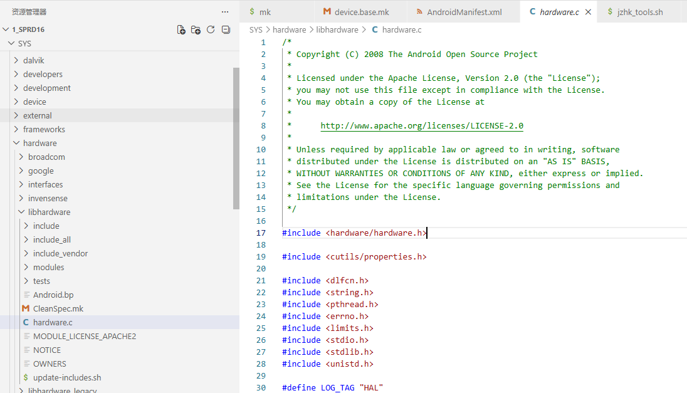
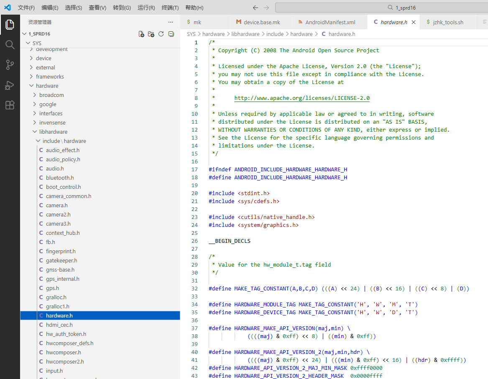
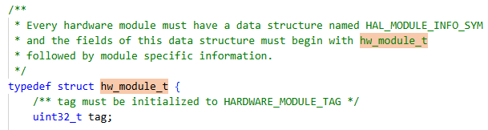

# `hw_module_t`结构体

用来描述硬件抽象层模块

# `hw_device_t`结构体

用来描述硬件设备

# 硬件抽象层模块文件的命名规范

硬件抽象层模块文件的命名规范定义在`hardware/libhardware/hardware.c`文件中



根据该文件的代码和注释，可以知道命名规范如下：

```
<MODULE_ID>.variant.so
```

- MODULE_ID：表示模块ID
- variant：表示四个系统属性，分别是`ro.hardware`、`ro.product.board`、`ro.board.platform`和`ro.arch`之一
- `ro.hardware`：通常是最具体的产品代号
- `ro.product.board`：主板代号
- `ro.board.platform`：处理器平台代号
- `ro.arch`：CPU架构

> 注意：
>
> 系统在加载硬件抽象层模块时，依次按照`ro.hardware`、`ro.product.board`、`ro.board.platform`和`ro.arch`的顺序来取他们的属性值。如果其中一个系统属性存在，那么就把它的值作为`variant`的值，然后再检查对应的文件是否存在，如果存在，就需要找到要加载的硬件抽象层模块文件；否则，就继续查找下一个系统属性。
>
> 如果这四个系统属性都不存在，或者对应于这四个系统属性的硬件抽象层模块文件都不存在，那么就使用`<MODULE_ID>.default.so`来作为要加载的硬件抽象层模块文件的名称

# 硬件抽象层模块结构体定义规范

结构体`hw_module_t`和hw_device_t及其相关的其他结构体定义在文件`hardware/libhardware/include/hardware/hardware.h`中



## `hw_module_t`的定义

源代码：



大致意思就是，每一个硬件模块，必须要有一个名字叫`HAL_MODULE_INFO_SYM`的数据结构，并且这个这个数据结构的第一个成员变量必须为`hw_module_t`

## `hw_device_t`的定义

硬件抽象层模块中的每一个硬件设备都必须自定义一个硬件设备结构体，而且它的第一个成员变量的类型必须为`hw_device_t`