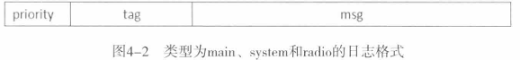
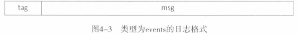
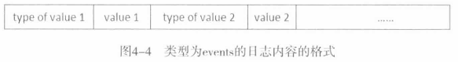

# 日志类型

日志类型有四种，分别是`main`、`system`、`radio`和`events`。分别通过`/dev/log/main`、`/dev/log/system`、`/dev/log/radio`和`/dev/log/events`四个设备文件来访问。

- main：应用程序级别。`android.util.Log`，写入的日志类型为`main`，下面同理
- system：系统级别。`android.util.Slog`
- radio：与无线设备相关
- events：诊断系统问题，`android.util.EventLog`

> 注意：
>
> 如果使用`android.util.Log`和`android.util.Slog`接口写入的日志标签值是以”RIL“开头或者等于”HTC_RIL“、”AT“、”GSM“、”STK“、”CDMA“、”PHONE“和”SMS“时，它们就会被转化为`radio`类型的日志

# 日志格式

## 前三种类型日志格式

前三种类型日志格式相同，格式如图：

- priority：表示日志优先级，是一个整数
- tag：表示日志标签，字符串
- msg：表示日志内容，字符串

> 日志优先级和日志标签可以在显示日志时作过滤字段使用。日志优先级重要程度一般划分为VERBOSE、DEBUG、WARN、ERROR和FATAL六种

## events日志格式

- tag：日志标签，整数
- msg：日志内容，二进制数据。一般来说，由一个或多个值组成，每个值前面都有一个字段来描述它的类型，如图：

