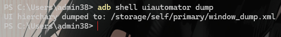
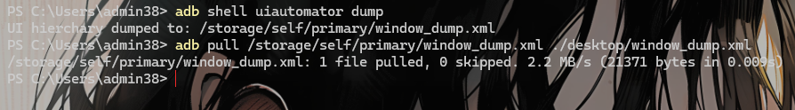
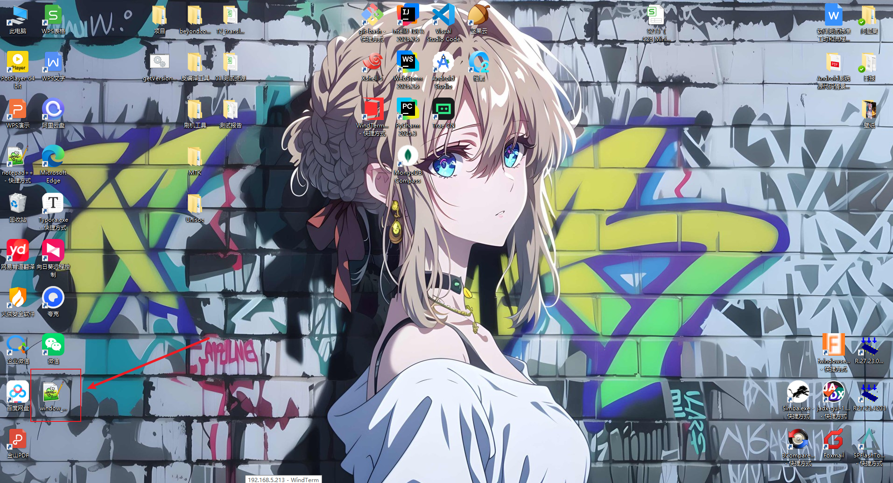
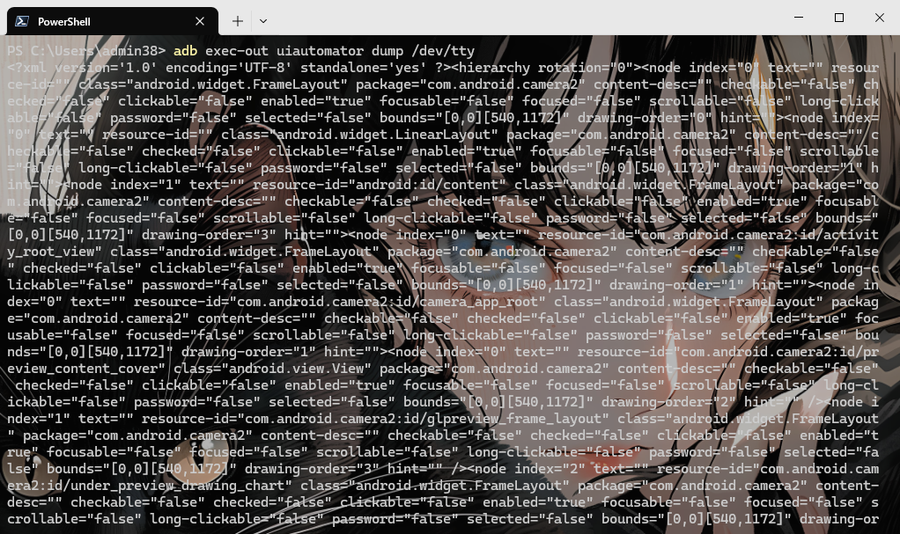

# 生成当前活动布局文件

```bash
# 在设备的/sdcard/目录下生成默认布局文件window_dump.xml
adb shell uiautomator dump

# 也可以自己指定路径
adb shell uiautomator dump <路径>
adb shell uiautomator dump /data/local/tmp/layout.xml
```



# 拉取到电脑

```bash
# 使用pull命令将生成的文件拉取到电脑
adb pull <设备中的路径> <拉取到电脑中的路径>
adb pull /sdcard/window_dump.xml
```





# 或者直接输出到终端

```bash
adb exec-out uiautomator dump /dev/tty
```


