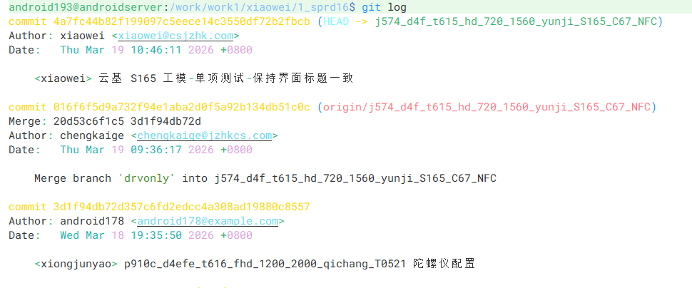
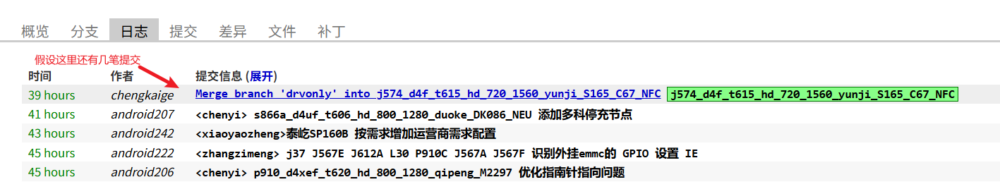

# 命令

```bash
git pull origin --rebase branchname
```


# 使用情况

本地有提交，远程也有







这个时候想要把本地的推送到远程仓库，会导致git树不是一条线或者出现冲突的情况。一般这个时候我们只能把本地的提交reset，然后pull远程最新的提交，再重新commit。

但是当我们本地的提交有很多笔的时候，就会导致重新commit的时候容易出错，漏掉文件。那么有没有办法能够不reset本地提交，还能让git树为一条直线呢？

有，我们可以使用`git pull origin --rebase branchname`命令，拉取远程的提交，然后将本地提交接在远程提交的后面。


# 如果变基过程中出现冲突：

1. Git 会暂停并提示冲突文件
2. 手动解决冲突
3. 使用 `git add` 标记已解决
4. 执行 `git rebase --continue` 继续

# 取消变基

如果想放弃当前变基操作：

```bash
git rebase --abort
```


# 与普通 pull 的区别

```bash
# 普通 pull（使用 merge）
git pull origin branchname
# 结果：会产生一个合并提交，历史有分叉

# 使用 rebase 的 pull
git pull origin --rebase branchname
# 结果：历史是线性的，没有多余合并提交
```

