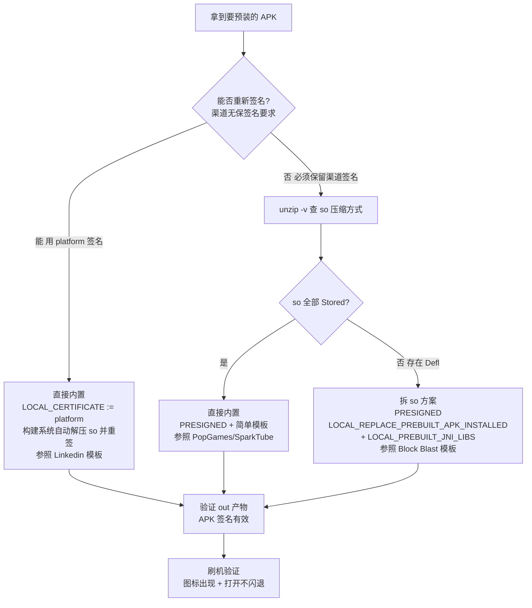

# 预装 APK 的 so 库处理原理

版本：V1.2，2026-08-13
适用平台：展讯 SYS 侧预装三方 APK（BUILD_PREBUILT 体系，Android 12+）
关联案例：云基 P03D 预装 Block Blast（com.block.juggle）闪退排查

## 0 背景

把三方 APK 预装进系统，同一个 APK 有时直接内置就能跑，有时必须把 so 拆出来单独放 lib 目录，否则打开即闪退。本文解释这个差异背后的完整机制，覆盖加载、压缩、签名、构建四个层面，最后给出判断流程和案例复盘。

## 1 Android app 的 native 库加载机制

本节从基础概念讲起，已熟悉的可以跳到第 2 节。

### 1.1 Native 库（so）是什么

so（Shared Object，共享库）是 **C/C++ 代码编译后的产物**。Android app 主要用 Java/Kotlin 写，跑在 ART 虚拟机里，但有些功能用 C/C++ 实现更合适——游戏引擎、音视频编解码、加密、数据库、JS 引擎等。这些 C/C++ 代码编译出的 so 就是 Native 库，Java 层通过 JNI（Java Native Interface）调用它。

常见例子：`libmmkv.so`（腾讯键值存储）、`libcocos2djs.so`（Cocos 游戏引擎）、`libhermes.so`（React Native 的 JS 引擎）。

关键约定：**so 必须放在 APK 里的 `lib/<abi>/` 目录**。abi 是 CPU 架构：arm64-v8a（64 位 ARM）、armeabi-v7a（32 位 ARM）、x86_64 等。设备运行在哪个架构，就加载对应目录下的 so。

> **说明**：游戏引擎类 app 必然带大量 so（Block Blast 有 248 个），预装这类 app 才会碰到本文的问题。纯 Java app 一个 so 都没有，不会闪退在这个点上。

### 1.2 加载机制与加载时机

**加载 = 把 so 从文件变成进程内存里可执行的代码**，分三步：

1. 找到 so 文件（从哪找，见 1.3）
2. mmap 进内存（见 1.4）
3. linker 重定位：解析 so 里引用的符号、绑定 JNI 入口，之后 Java 才能调用

**加载时机：不是开机加载，是 app 进程内第一次用到某库的瞬间。** 每个 so 通常对应一个 Java 类，类的静态初始化块里写 `System.loadLibrary("mmkv")`，该类首次被访问时触发。

Block Blast 的崩溃堆栈正好演示了这个时机：

```
DemokApplication.attachBaseContext   ← app 进程刚启动，Application 创建
  → o0.V0
    → wb.u.a
      → wb.u$a.<clinit>              ← 类首次被访问，触发初始化
        → MMKV 类初始化 → loadLibrary("mmkv") → 找 so
        → 找不到 → 后续初始化全部失败 → NPE 闪退
```

所以闪退发生在"点开图标的一瞬间"。加载失败会抛 `UnsatisfiedLinkError`；如果 app 把异常吞了，会像 Block Blast 这样表现为后续的 NPE——这是它难排查的原因（排查见第 8 节）。

### 1.3 两条加载路径

`System.loadLibrary("xxx")` 触发后，linker 从两条路径找 so：

1. **nativeLibraryDir**：APK 旁固定结构的目录（概念见 1.5）
   - 普通安装：`/data/app/<pkg>-<hash>/lib/<abi>/`
   - 系统预装：`/system/app/<App>/lib/<abi>/`
2. **APK 文件内部**：直接 mmap APK zip 包里的 `lib/<abi>/xxx.so` 条目

搜索顺序：先 nativeLibraryDir，找不到再试 APK 内条目。

### 1.4 mmap 是什么

mmap（memory map，内存映射）**把文件的一段字节直接映射到进程虚拟地址空间**，代码读写这块内存就等于读写文件，不需要复制文件内容，按需读页（读哪页才加载哪页）。

类比：mmap 像是把书摊开直接读，文件在磁盘上是什么字节，映射进内存后就是什么字节。

对 so 加载的关键含义：**CPU 执行的是机器码字节**。mmap 把 so 映射进内存后，这些字节本身就是 ARM 机器码，CPU 直接执行。因此"文件里存的是什么，映射后就是什么"——如果 zip 里存的是 Deflate 压缩流而不是机器码，mmap 出来的就是压缩数据，CPU 无法执行。

由此推出第二条路径的硬性前提：

- so 条目在 zip 里必须是 **Stored（未压缩）** 状态
- 条目偏移需要 **页面对齐**（4KB）

Stored 的 so 在 zip 里存的就是原始机器码，mmap 后可直接执行；Defl 的 so 必须先整体解压还原，而"解压再执行"这条路在预装场景不存在（见第 3 节）。

### 1.5 nativeLibraryDir 是什么

**nativeLibraryDir = Native 库目录，一个路径**，app 进程运行时从这个目录里找 so 实体文件。该路径在安装/扫描时确定并存进 PM（包管理服务），进程启动时传给 classloader：

- 普通安装：`/data/app/<pkg>-<hash>/lib/<abi>/`（安装流程提取 so 到这里）
- 系统预装：`/system/app/<App>/lib/<abi>/`（必须构建镜像时就生成，运行时无法创建）

### 1.6 Stored 与 Deflate

zip 条目的两种存储方式：

| 存储方式 | 含义 | 体积 |
|---------|------|------|
| Deflate | 压缩存储，读取时需解压 | 小（约压缩 50-70%） |
| **Stored** | 原样存储，不压缩 | 大（等于原始大小） |

同一个 zip 里可以混用：Block Blast 的 APK 资源是 Deflate（省空间），so 也是 Deflate（打包工具默认行为）——只有 so 是 Deflate 才构成问题。

判断方式：

```bash
unzip -v xxx.apk | grep "\.so" | head -3
```

输出行尾的 `Stored` 或 `Defl:N` 就是答案。

### 1.7 manifest 里的开关：extractNativeLibs

APK manifest 的 application 节点有 `android:extractNativeLibs` 属性，声明"安装后 so 要不要从 APK 提取成独立文件"：

| 值 | 行为 | 运行依赖 |
|----|------|---------|
| true（旧 targetSdk 默认） | 安装时把 so 提取到 nativeLibraryDir | 依赖安装流程做提取，Defl 也能提取 |
| false | 不提取，运行时直接从 APK 加载 | so 必须 Stored + 页面对齐 |

> **注意**：extractNativeLibs=true 只保证"安装流程会提取"，但提取动作依赖目标目录可写。系统预装到只读分区时这条不成立（见第 3 节）——哪怕属性是 true，预装也拿不到提取目录，还是要回到"构建时放进 lib 目录"或"APK 内 so 是 Stored"这两条路。

### 1.8 全链条串起来

```
app 启动 → loadLibrary("mmkv") → 找 so
  ├─ 路径 1：nativeLibraryDir（/system/app/BlockBlast/lib/arm64/）→ 没构建出来，不存在
  └─ 路径 2：APK 内条目 → Defl 压缩，mmap 出来是压缩流，CPU 无法执行
→ 两条路全堵 → native 初始化失败 → 闪退
```

普通安装的同一台设备：so 被提取到 `/data/app/.../lib/arm64/` → 路径 1 通 → 正常运行。这就是"普通安装没问题、预装闪退"的全部原理。

## 2 APK 内 so 的两种压缩方式

### 2.1 是什么决定的

渠道方打包 APK 的工具链决定 so 的压缩方式。同一个 App 的正式包和渠道重打包包可能完全不同：

- Google Play 正式渠道包：so 基本是 Stored（Play 要求对齐，安装链路直接 mmap）
- 三方渠道重打包包：经常变成 Defl（打包工具默认压缩），Block Blast 的 TCL 预装包就是这种情况

### 2.2 怎么查

```bash
unzip -v xxx.apk | grep "\.so" | head -3
```

- 输出 `Stored` → 未压缩，可 mmap 直接执行
- 输出 `Defl:N` → 压缩，能否直接预装取决于签名策略（见第 4 节，不是必然要拆 so）

> **注意**：**Defl:N 不等于必须拆 so**。实测里 Linkedin（Defl）用 platform 签名直接预装就能跑，因为构建系统在重签名的前提下可以顺手把 so 解压成 Stored。真正决定要不要拆 so 的是"能不能重新签名"，见第 6 节判断流程。

实测数据（云基 P03D 项目）：

| APK | so 压缩方式 | 签名策略 | 预装表现 |
|-----|-----------|---------|---------|
| PopGames | 全 Stored | PRESIGNED | 直接内置正常 |
| SparkTube | 全 Stored | PRESIGNED | 直接内置正常 |
| Linkedin | 全 Defl（构建时被解压） | platform 重签 | 直接内置正常 |
| Block Blast | 全 Defl | PRESIGNED（渠道要求保签名） | 必须拆 so + lib 目录 |

## 3 普通安装 vs 系统预装的差异

### 3.1 普通安装（/data/app）

`pm install` 走 PackageManager 完整安装流程，其中 `NativeLibraryHelper.copyNativeBinariesForSupportedAbi` 会把 APK 里当前 ABI 的 so 解压到 `/data/app/<pkg>-<hash>/lib/<abi>/`。这个目录在 data 分区，可写。

所以 Defl so 的 APK 普通安装后照样能跑 —— so 被提取出来了。

实测：Block Blast 普通安装后正常运行；手动删掉它的 lib/arm64 目录再启动，出现与预装完全相同的闪退。这一条直接证明"预装闪退 = so 不可加载"。

### 3.2 系统预装（/system）

- system 分区是 erofs 只读，PM 扫描时**无法在运行时提取 so**（提取目录写不进去）
- 因此 so 必须在**构建 system 镜像时**就已经以"可直接加载"的形态存在：
  - 要么 so 在 APK 内是 Stored（mmap 路径）
  - 要么构建时把 so 装进 `/system/app/<App>/lib/<abi>/`（目录路径）

缺其一，app 进程里 `System.loadLibrary` 全部失败，依赖 native 库的初始化（如 MMKV、React Native、Cocos）随之失败。

## 4 签名机制（决定构建系统敢不敢动 APK）

### 4.1 V1/V2/V3 签名

| 方案 | 覆盖范围 | 被 zip 修改破坏 |
|------|---------|----------------|
| V1（JAR） | 各条目 | 是 |
| V2（APK Signing Block） | 整个 APK 字节 | 是 |
| V3（含 Source Stamp） | 整个 APK 字节 | 是 |

任何对 zip 内容的修改（解压 so、重压缩、删除条目）都会让 V2/V3 校验失败。V1 校验的是条目内容，so 数据变了也失败。

### 4.2 签名策略决定构建路径

`LOCAL_CERTIFICATE` 选什么，决定了构建系统敢不敢改动 APK。`build/core/app_prebuilt_internal.mk` 的行为分两条路径：

**路径 A：`LOCAL_CERTIFICATE := platform`（或其它可重签证书）—— 构建系统随便改 APK**

- `do_not_alter_apk` 只在 PRESIGNED 时生效，非 PRESIGNED 一律走 alter 分支
- 流程：`uncompress-prebuilt-embedded-jni-libs`（把所有 so 解压成 Stored）→ `sign-package`（用平台签名重新签名）→ zipalign
- 结果：**so 变 Stored + 新签名有效**，无需拆 so，直接内置
- 实测：Linkedin 源 APK 的 so 是 Defl（115MB），构建产物里变 Stored（193MB），签名是有效的平台签名，直接预装正常

**路径 B：`LOCAL_CERTIFICATE := PRESIGNED`（保留渠道签名）—— 构建系统不敢动 APK**

- 情形 B1：有 `LOCAL_REPLACE_PREBUILT_APK_INSTALLED`：APK 原样作为安装产物，签名和 so 压缩方式都原封不动
- 情形 B2：SDK 30+ 且无 REPLACE：`do_not_alter_apk := true`（PRESIGNED + LOCAL_SDK_VERSION>29 判断），同样不改动 APK——**有意保护签名**
- 情形 B3：无 REPLACE 且不满足保护条件：走 alter 分支解压 so，但 **PRESIGNED 跳过 sign-package，so 解压的同时 V2/V3 签名被剥离**，产物签名无效

### 4.3 签名被剥离的后果：应用直接消失

PM 扫描 APK 时做 `ParsingPackageUtils.collectCertificates` 取签名信息：先找 V2/V3，找不到回退 V1 校验。V1/V2/V3 全无效时 **解析失败，整个包被跳过** —— 不是闪退，是应用根本不出现。

实测：删掉 LOCAL_REPLACE_PREBUILT_APK_INSTALLED 后重新编译，out 产物 APK 413MB（so 已解压），`apksigner verify` 输出 `DOES NOT VERIFY`，刷机后桌面无 Block Blast。

> **警告**：system 分区预装本身不校验签名（信任分区内容），但 PM 的**解析阶段**要求 APK 存在有效签名结构。两者不是一回事，别混淆。
> **说明**：换 platform 签名有个代价——app 内部对自身签名的校验（如渠道 SDK 的归因、应用内防重打包校验）可能失效。Linkedin 这类对签名不敏感的三方 app 可以用；渠道明确要求保签名的（如 Block Blast 的 TCL 预装包，归因绑定签名）必须走 PRESIGNED。

## 5 正确方案：LOCAL_PREBUILT_JNI_LIBS

### 5.1 机制

`build/core/install_jni_libs_internal.mk` 对 `LOCAL_PREBUILT_JNI_LIBS`（源码树里的实体 so 文件）的处理：

```make
my_app_lib_path := $(dir $(LOCAL_INSTALLED_MODULE))lib/$(TARGET_ARCH)
...
# Install my_prebuilt_jni_libs as separate files.
$(foreach lib, $(my_prebuilt_jni_libs), \
    $(eval $(call copy-one-file, $(lib), $(my_app_lib_path)/$(notdir $(lib)))))
```

即：**把 so 作为独立文件拷贝到 APK 旁 `lib/<abi>/` 目录**，装进系统镜像。前提是 `my_embed_jni` 为 false（APK 装在 /system、/vendor、/product、/system_ext 等支持分区时成立，见 `supported_partition_patterns`）。

### 5.2 为什么能同时满足两个约束

- APK 不动（LOCAL_REPLACE_PREBUILT_APK_INSTALLED 原样）→ 签名有效 → PM 正常解析
- so 在 `lib/arm64/` 目录 → linker 走 nativeLibraryDir 路径加载 → native 初始化成功

### 5.3 标准模板（Block Blast 最终版）

```make
LOCAL_PATH := $(call my-dir)
include $(CLEAR_VARS)
LOCAL_MODULE := BlockBlast
LOCAL_MODULE_TAGS := optional
LOCAL_MODULE_CLASS := APPS
LOCAL_MODULE_PATH := $(TARGET_OUT)/app
LOCAL_MODULE_SUFFIX := $(COMMON_ANDROID_PACKAGE_SUFFIX)
LOCAL_CERTIFICATE := PRESIGNED
LOCAL_REPLACE_PREBUILT_APK_INSTALLED := $(LOCAL_PATH)/BlockBlast.apk
LOCAL_DEX_PREOPT := false
LOCAL_SRC_FILES := BlockBlast.apk
LOCAL_OPTIONAL_USES_LIBRARIES := android.ext.adservices
LOCAL_REQUIRED_MODULES := oukitel_260226_pre_install.appsflyer
ifeq ($(my_src_arch),arm64)
LOCAL_MULTILIB := both
else ifeq ($(my_src_arch),x86_64)
LOCAL_MULTILIB := both
endif
ifeq ($(my_src_arch),arm)
JNI_LIBS :=
$(foreach FILE,$(shell find $(LOCAL_PATH)/lib/armeabi-v7a/ -name *.so), $(eval JNI_LIBS += $(FILE)))
LOCAL_PREBUILT_JNI_LIBS := $(subst $(LOCAL_PATH),,$(JNI_LIBS))
else ifeq ($(my_src_arch),arm64)
JNI_LIBS :=
$(foreach FILE,$(shell find $(LOCAL_PATH)/lib/arm64-v8a/ -name *.so), $(eval JNI_LIBS += $(FILE)))
LOCAL_PREBUILT_JNI_LIBS := $(subst $(LOCAL_PATH),,$(JNI_LIBS))
endif
include $(BUILD_PREBUILT)
```

配套的源码树结构：

```
third_preloadapp/BlockBlast/
├── Android.mk
├── BlockBlast.apk          # 原样，签名不动
├── lib/
│   ├── armeabi-v7a/*.so    # 从 APK 拆出的 32 位 so
│   └── arm64-v8a/*.so      # 从 APK 拆出的 64 位 so
└── oukitel_260226_pre_install.appsflyer
```

> **说明**：`LOCAL_PREBUILT_JNI_LIBS` 与 `LOCAL_PREBUILT_EMBEDDED_JNI_LIBS` 语义不同。后者把 so 塞回 APK（会动 APK、破坏签名），前者独立安装到 lib 目录。预装场景只能用前者。
> **说明**：拆 so 后 APK 里仍保留 Defl so（不做删除），体积影响很小；独立 lib 目录的 so 是未压缩实体，最终镜像体积增加约等于 so 原始大小之和。

## 6 预装流程与判断

### 6.1 预装 app 整体流程

从客户给 APK 到验证通过的标准流程：

```
1. 客户提供 APK（+ 预装要求文档）
        ↓
2. 看预装要求文档：是否写明了预装方式？
   - 写了（装哪个目录、是否保签名、有没有归因文件等要求）→ 按文档走
   - 没写 → 进入第 3 步
        ↓
3. 问客户：能否重新签名？
   - 确认点：归因/渠道结算是否绑定原签名？app 之后是否会单独升级？
        ↓
4. 按签名策略分支处理（见 6.2 与流程图）
        ↓
5. 编译，检查 out 产物（见第 7 节）
        ↓
6. 刷机验证：桌面有图标 + 打开不闪退
   （渠道有归因要求的，还要做归因测试：应用内用户 ID + GAID 报给客户核对）
```

### 6.2 签名策略判断

**必须保留原签名（不能重签）的情况：**

1. 客户/渠道在预装要求文档里明确要求保签名
2. app 内部校验自身签名——重签后出现隐蔽问题：
   - 渠道归因 SDK（如 appsflyer）绑定签名与安装渠道，重签后归因失败，客户拿不到结算数据
   - 防重打包校验（app 启动比对签名证书，不一致拒绝启动或功能降级）
   - 支付/登录类 SDK 用签名做安全校验
3. app 之后要从 Google Play 或客户服务器单独升级（签名不一致无法覆盖安装）

**可以重新签名（platform 签名）的情况：**

1. 客户无保签名要求，app 内部也不校验签名（大多数普通三方 app）
2. app 预装后不单独升级，跟随系统 OTA 整体更新
3. 附加好处：platform 签名可让 app 获得 signature 级系统权限

**保守原则：不确定就默认保留签名。** 重签后 app 内部校验失败的表现（黑屏、功能失效、归因对不上账）比拆 so 的工程成本隐蔽得多，拆 so 只是多花几分钟，重签错了要返工找客户确认。

**问客户的完整问题清单：**

1. 这个 APK 预装可以重新签名吗？
2. 归因/渠道结算有没有绑定原签名？
3. 之后会单独升级这个 app 吗？

### 6.3 so 判断流程图



操作步骤：

1. **先看文档**：客户给的预装要求文档有没有写明预装方式（保签名、目录、归因文件）
2. **再问签名**：文档没写就问客户能否重新签名（问法见 6.2），这是第一判断
   - 允许 → 用 `LOCAL_CERTIFICATE := platform` 直接内置，构建系统自动把 Defl so 解压成 Stored 并重签，最省事（Linkedin 方式）
   - 不允许（要求保留原签名）→ 继续第 3 步
3. 查压缩：`unzip -v xxx.apk | grep "\.so" | head -3`，混有 Defl 就算 Defl
   - 全 Stored → 直接内置（PopGames 模板，PRESIGNED 简单 Android.mk）
   - 有 Defl → 拆 so 方案（第 5.3 节模板）
4. 拆 so：`unzip -o -q xxx.apk "lib/armeabi-v7a/*" "lib/arm64-v8a/*" -d <模块目录>`
5. main.mk 加 `PRODUCT_PACKAGES += <模块名>`
6. 编译后检查 out（见第 7 节）
7. 刷机验证：桌面有图标 + 打开不闪退 + 归因测试（如客户有要求）

> **注意**：选择 platform 重签前确认 app 对自身签名的敏感度。渠道 SDK 归因、防重打包校验绑定了原签名的 app（如 Block Blast 的 TCL 归因包）只能用 PRESIGNED 路径。

### 6.4 实测验证兜底流程

静态判断（unzip）无法定论时，用真机实测一锤定音：

```
1. 普通方法内置（PRESIGNED 简单模板，APK 原样）
        ↓
2. 刷机/升级后打开：
   - 正常 → 内置完成，收工
   - 闪退 → 进入第 3 步
        ↓
3. pm uninstall 卸载预装版，adb install 普通安装
        ↓
4. 打开：
   - 正常打开 → 差异在预装方式的 so 提取 → 拆 so 方案（第 5.3 节）
   - 安装失败或打开也闪退 → APK 或运行环境问题，联系客户/渠道确认
```

注意事项：

- **普通安装能跑后，可加一步严谨确认**：删掉 `/data/app/<pkg>-*/lib/arm64/` 提取目录再启动，崩溃 = 100% 确认 so 问题，拆 so 方向不会错（Block Blast 就是这样验证的）
- **"普通安装也异常"不等于 APK 本身损坏**：可能是 APK 依赖 GMS 或特定系统服务、安装本身失败（先确认 `pm install` 返回 Success）、设备环境差异。结论说成"APK 或运行环境问题，找客户确认"
- **第 1 步的基线模板必须用 PRESIGNED 简单模板**（APK 原样）：不要用会动签名的写法（如删 LOCAL_REPLACE_PREBUILT_APK_INSTALLED），否则现象变成"应用消失"而非"闪退"，对照就混淆了
- 已按 6.3 判断出方向的，无需做本实验，直接按方向实施

## 7 编译后产物验证

```bash
# 产物结构：APK + lib 目录必须同时存在
ls SYS/out_system/target/product/ussi_arm64/system/app/BlockBlast/
# 期望：BlockBlast.apk + lib/arm64/（66 个 so）

# APK 签名必须有效（决定应用是否出现）
SYS/out_system/host/linux-x86/bin/apksigner verify \
    SYS/out_system/target/product/ussi_arm64/system/app/BlockBlast/BlockBlast.apk
# 期望：无输出（通过）；出现 DOES NOT VERIFY 说明签名被破坏，应用会消失
```

## 8 案例复盘：Block Blast 三次尝试

| 尝试 | Android.mk 状态 | 结果 | 原因 |
|------|----------------|------|------|
| 第一次 | REPLACE + 无 lib | 打开闪退 | Defl so 无法加载，MMKV 初始化失败 NPE |
| 第二次 | 删 REPLACE | 应用消失 | so 被解压但 V2/V3 签名剥离，PM 解析失败 |
| 第三次 | REPLACE + LOCAL_PREBUILT_JNI_LIBS | 正常 | 签名保留 + so 独立装 lib/arm64 |

其中第一次闪退的崩溃特征（logcat -b crash）：

```
java.lang.ExceptionInInitializerError
Caused by: java.lang.NullPointerException: ... com.tencent.mmkv.MMKV.decodeBool ...
```

app 里依赖 native 的组件（MMKV、React Native、Cocos 等）在 so 不可加载时，初始化链静默失败后返回 null，最终表现为 NPE 而不是 UnsatisfiedLinkError，容易误判方向。遇到这类"预装闪退"优先查 so 加载路径，而不是追 app 代码。

## 变更记录

| 日期 | 版本 | 内容 |
|------|------|------|
| 2026-08-13 | V1.0 | 初版：机制说明 + 判断流程 + Block Blast 案例复盘 |
| 2026-08-13 | V1.1 | 第 1 节扩展为基础概念篇：Native 库、加载时机、mmap、nativeLibraryDir、Stored、extractNativeLibs 逐个详解 |
| 2026-08-13 | V1.2 | 修正判断规则：决定性因素是签名策略而非 so 压缩方式。补 Linkedin 反例（Defl + platform 重签直接预装正常），第 4 节重写为双路径对照，第 6 节判断流程改为先确认能否重签 |
| 2026-08-13 | V1.3 | 第 6 节重构为「预装流程与判断」：6.1 整体流程（看文档 → 问签名 → 分支 → 验证）、6.2 签名策略判断（必须保签名/可重签的情形 + 问客户问题清单 + 保守原则）、6.3 so 判断流程图 |
